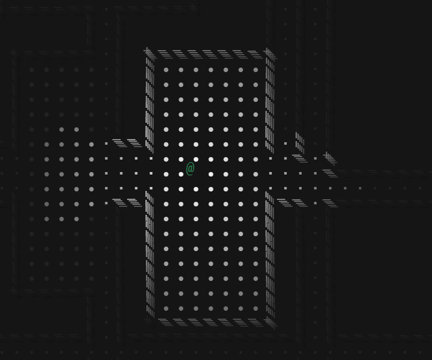

# Poor Rouge Engine

I have to stop writing engines. A simple engine for the future roguelike game. I add some crap here that I can figure out, like raycasting. I try to keep a decent style. So far we have an engine loop, player character tracking, different types of tiles and some utils functions.

## So far it looks like this:

